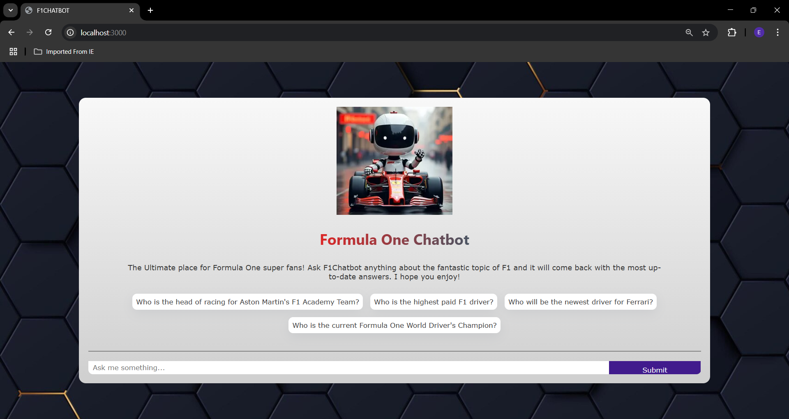
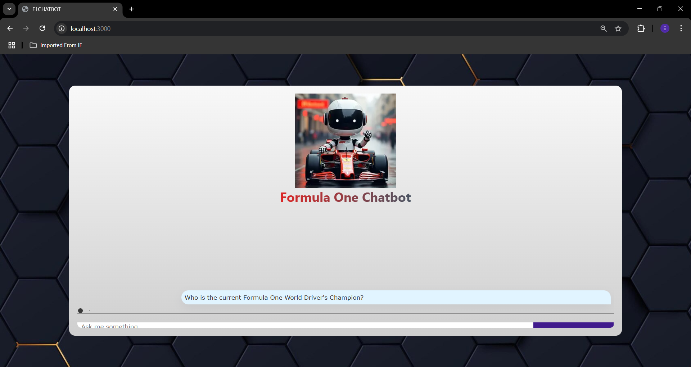

# Formula One Chatbot – Powered by RAG and Next.js

## Overview
This Formula One chatbot is a cutting-edge web application designed to provide users with comprehensive and accurate information about Formula One. It leverages a Retrieval-Augmented Generation (RAG) architecture to combine data scraping, dynamic querying, and robust machine learning models, offering precise and insightful responses to F1-related queries.

---

## Key Features

### 1. Data Retrieval and Storage
- **Scraping with OpenAI API**: Uses OpenAI API to fetch and curate relevant Formula One data, ensuring an up-to-date and high-quality knowledge base.
- **Database Integration**: Stores data in **Astra DB** for scalable and efficient retrieval during user interactions.

### 2. Interactive Chat Interface
- **Prompt Suggestions**: Homepage includes clickable prompt suggestions to help users discover what they can ask the chatbot.
- **Real-time Loading Animation**: Displays a visually appealing loading bubble while fetching responses, enhancing user experience.
- **Dynamic Chatbox**: Provides a sleek and interactive chat interface for seamless communication.

### 3. Modern Tech Stack
- **Next.js**: Offers server-side rendering for improved performance and SEO.
- **React.js with TypeScript**: Provides type safety and ensures a robust, maintainable codebase.
- **LangChain.js**: Processes and chains queries for enhanced contextual understanding.
- Powered by npm packages: **openai** and **ai** for API integration.

### 4. User-Friendly Setup
- Simple instructions for developers to set up and start using the chatbot quickly.

---

## Setup Instructions

### 1. Clone the Repository
Run the following command to clone the repository:
```bash
git clone https://github.com/eizadhamdan/Chatbot.git
```
### 2. Install Dependencies
Navigate to the project directory and install the required npm packages:
```bash
npm install
```
### 3. Configure Environment Variables
- Locate the .env.example file in the project directory.
- Create a new .env file and copy the variables from .env.example into it.
- Fill in the appropriate values (e.g., OpenAI API keys, database credentials).
### 4. Seed the Database
Run the following command to scrape Formula One data and populate the database:
```bash
npm run seed
```
### 5. Start the Development Server
Launch the application in development mode:
```bash
npm run dev
```
### 6. Access the Chatbot
Open your browser and navigate to `http://localhost:3000`

## How It Works
### 1. Data Gathering
The chatbot uses the OpenAI API to fetch the latest Formula One data during the initial setup (`npm run seed`) and saves it in Astra DB.
### 2. Query Processing
When a user enters a query, the chatbot fetches relevant data from the database and uses LangChain.js to process the query and generate a response.
### 3. User Interaction
Responses are displayed in a sleek, dynamic chatbox with a visually appealing loading bubble animation, ensuring an intuitive and engaging user experience.

## User Experience
- Homepage: Features a clean interface with prompt suggestions for quick queries.

- Chat Experience: Displays a loading bubble animation while fetching responses, providing a polished and engaging interaction.

#### This chatbot is a perfect blend of modern web technologies and user-friendly design, making it an ideal tool for Formula One enthusiasts and developers alike.